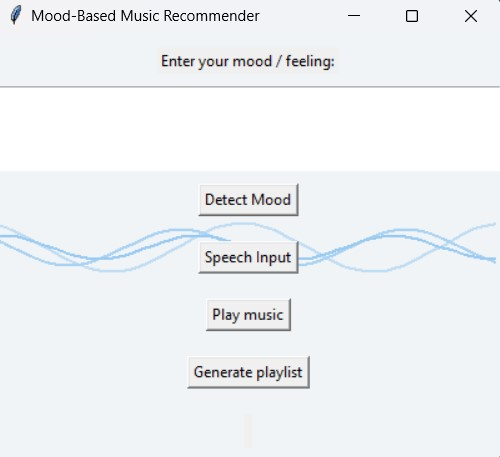
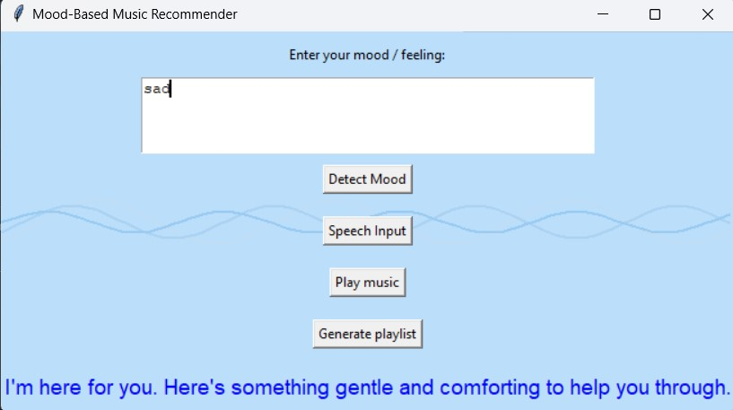

# AIMoodRecommendation

## **Description**  
AIMoodRecommendation is a smart music recommendation app built with Python that understands your emotions through speech or text input, and curates personalized music based on your mood using the Spotify API. The app features a user-friendly GUI, emotion detection using DistilRoBERTa, and real-time speech/text input support. A future update may also include a built-in music player.

## **Table of Contents**  
- [Features](#features)
- [Tech Stack](#teck-stack)
- [Emotion detection pipeline](#emotion-detection-pipeline)
- [Mood-to-music mapping process](#mood-to-music-mapping)
- [Installation](#installation) 
- [How to use](#how-to-use)   
 

## 🌟**Features**
- 🎤 **Speech & Text Recognition** – Input your feelings using voice or text.  
- 😄 **Emotion Detection** – Uses a fine-tuned DistilRoBERTa model (j-hartmann/emotion-english-distilroberta-base) to classify emotions.
- 🎧 **Spotify Integration** – Connects to Spotify to recommend songs based on your detected mood.
- 🖼️ **Graphical User Interface (GUI)** – Simple,interactive and clean GUI for interaction. 
- 📋 **Playlist Generator** – Possibility to create a mood-based playlist.
- 🎶 **(Coming Soon) Optional music player** to play a preview of recommended tracks inside the app.

## 🛠️ **Tech Stack**
- Python 3.10+
- Transformers (Hugging Face)
- SpeechRecognition 
- Spotify API (Spotipy)
- pyaudio
- Tkinter 

## 🧠 **Emotion Detection Pipeline**
- **Input**: User provides speech or typed text.
- **Processing**:
    - **Speech** is transcribed using a **speech-to-text model**.
    - **Emotion** is **detected from text using DistilRoBERTa**.
    - **Mapping**: **Detected emotion is mapped to a mood category using the circumplex model of Russel (valence-arousal space)**.
    - **Recommendation**: Songs matching the mood are fetched from Spotify
- **Playlist generation**: Playlist is generated based on the mood detected if user choose to

## **Mood-to-music mapping** 
- **Dataset** : dataset of **67077 songs and 196 music genres**, merged from several kaggle datasets containing key audio features  
- **Methods used**  
  - **k-means clustering** (k=15): clusters supposed to group songs having similarity (each of them supposed to represent an emotion)  
  - **clusters analysis**: centroids, silhouette and the mean, median, and standard deviation of each audio features in ecah cluster 
  - **Emotion mapping**: clusters plotted on the circumplex model of Russel to map them to emotions  
- **Emotion mapping transposed in our app for machine learning based music recommendations** 

## 🧪**Installation**  
- Clone or download the repository
<pre> git clone https://github.com/Alicia105/AIMoodRecommendation.git </pre>
- Navigate to the project directory
<pre> cd AIMoodRecommendation</pre>
- Install needed dependencies
<pre> pip install -r requirements.txt</pre>
- Create a .env file in the root of your project 
- Create a **Spotify Developer Account** and set the following environment variables in your environment file .env
<pre>SPOTIPY_CLIENT_ID='your_client_id'
export SPOTIPY_CLIENT_SECRET='your_client_secret'
export SPOTIPY_REDIRECT_URI='http://localhost:8888/callback'</pre>

## 🚀**How to use** 
1. Navigate to the project source code directory
<pre> cd AIMoodRecommendation/src</pre>

2. Launch the app
<pre> python aiRecommender.py</pre>

3. Once you run the app you optain the following comment in the terminal (It can take a few minutes)
<pre> Device set to use cpu</pre>

4. The following window open

5. You can enter a text and click on "**Detect Mood**". You'll end up with a similar result :

6. You can click on "**Speech Input**" and you'll here a beep. Speak after the beep for your sentence to be heard and processed

7. (Coming Soon)

8. Once your current mood has been properly detected you can click on "**Generate playlist**" to generate a playlist you can listen too in your Spotify App. 

